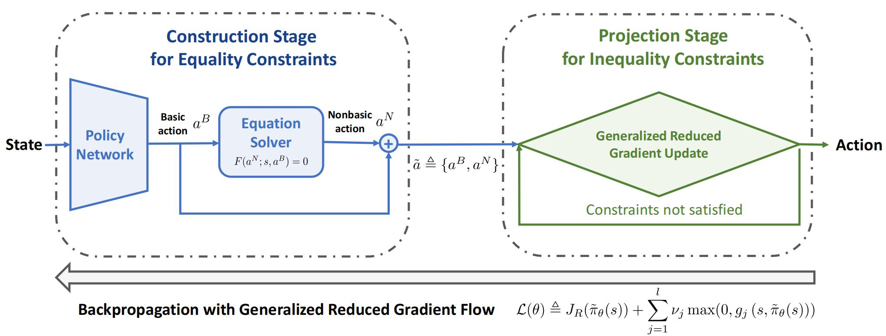

# [NeurIPS 2023] Reduced Policy Optimization for Continuous Control with Hard Constraints

Code release for **Reduced Policy Optimization for Continuous Control with Hard Constraints (NeurIPS 2023)**.

[[paper]](#) [[project page]](#)



## Requirements

## Preparation

To run the experiments, you need to first install the python package rpo via running `pip install .` in the current directory.

## Getting started
Then, You can simply 

run `python scripts/cart_exp.py` to re-implement our experiments on the Safe Cartpole environment using RPODDPG algorithm.

run `python scripts/pen_exp.py` to re-implement our experiments on the Spring Pendulum environment using RPODDPG algorithm.

run `python scripts/evopf_exp.py` to re-implement our experiments on the OPF with Battery Energy Storage environment using RPODDPG algorithm.

run `python scripts/cart_exp_sac.py` to re-implement our experiments on the Safe Cartpole environment using RPOSAC algorithm.

run `python scripts/pen_exp_sac.py` to re-implement our experiments on the Spring Pendulum environment using RPOSAC algorithm.

run `python scripts/evopf_exp_sac.py` to re-implement our experiments on the OPF with Battery Energy Storage environment using RPOSAC algorithm.

## Citation
If you find this repository useful in your research, please consider citing:

```
@inproceedings{
ding2023reduced,
title={Reduced Policy Optimization for Continuous Control with Hard Constraints},
author={Shutong Ding and Jingya Wang and Yali Du and Ye Shi},
booktitle={Thirty-seventh Conference on Neural Information Processing Systems},
year={2023},
url={https://openreview.net/forum?id=fKVEMNmWqU}
}
